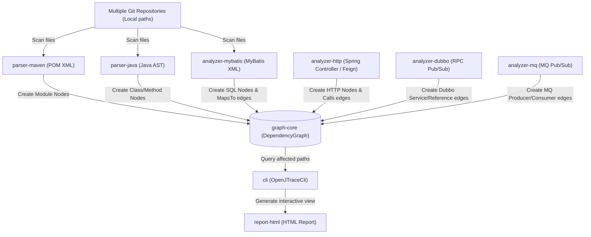

# OpenJTrace Architecture

本文档介绍 OpenJTrace 的系统架构设计、核心模型和数据流。

---

## 🎨 架构概览

OpenJTrace 采用多模块插件化设计，旨在解耦依赖解析（Parser）、协议关联分析（Analyzer）、依赖图建模（Graph Core）与报告呈现（Report / CLI）。

---

## 📦 核心模块说明

### 1. `graph-core` (核心图结构)
* **职责**：定义图的内存模型。
* **主要概念**：
  * `Node` (节点)：代表代码或配置实体。
    * 类型：`METHOD`（普通方法）、`HTTP_API`（HTTP 端点）、`DUBBO_SERVICE`（Dubbo 服务端实现）、`DUBBO_REFERENCE`（Dubbo 客户端接口引用）、`SQL_QUERY`（MyBatis XML 中的具体 SQL 映射语句）。
  * `Edge` (边)：代表节点之间的依赖关系。
    * 类型：`CALLS`（方法间调用）、`IMPLEMENTS`（接口实现）、`MAPS_TO`（Mapper 接口方法映射至 XML SQL）、`RPC_LINK`（Dubbo 消费端跨仓连接至服务端实现）。
  * `DependencyGraph`：图操作类，支持图的构建、序列化、正向链路追踪以及逆向受影响路径查找。

### 2. `parser-maven` (Maven 工程依赖解析器)
* **职责**：解析多仓库、多模块下的 Maven 拓扑关系。
* **机制**：
  * 读取各个项目根目录下或子目录下的所有 `pom.xml`。
  * 提取 GAV，并解析模块之间的依赖关系。
  * 通过 GAV 关系，确定跨仓库的依赖物理边界，以便将各个分离仓库的代码文件映射到统一的依赖图空间。

### 3. `parser-java` (Java AST 语法解析器)
* **职责**：静态解析 Java 源码文件，提取类、接口、方法以及方法内部的调用链。
* **实现**：使用 `JavaParser` 工具，以不依赖完整编译环境的方式生成轻量 AST（抽象语法树），提取类注解、方法注解、方法签名、以及方法内部对其他方法的调用表达式。

### 4. `analyzer-http` (HTTP 路由与 Feign 关联分析器)
* **职责**：提取 Spring Controller API 并与 HTTP 客户端（如 FeignClient）建立调用关系。
* **解析范围**：`@RestController`, `@RequestMapping`, `@GetMapping`, `@PostMapping` 等。
* **Feign 关联**：识别 `@FeignClient` 注解，并将 Feign 接口的方法与实际 Controller 的端点路径拼接，建立 `CALLS` 边。

### 5. `analyzer-dubbo` (Dubbo 服务关联分析器)
* **职责**：提取 Dubbo 分布式 RPC 链路的发布与订阅关联。
* **实现**：
  * 服务端（Provider）：解析方法或类上的 `@DubboService` 或 `@Service`，记录其实现的 Java 接口全限定名。
  * 消费端 (Consumer)：解析类成员变量上的 `@DubboReference` 或 `@Reference`，记录引用的 Java 接口全限定名。
  * 跨仓关联逻辑：当扫描完全部仓库后，如果发现消费端的 Reference 接口与服务端的 Service 接口全限定名一致，则在它们之间连接一条跨服务的 `RPC_LINK` 边。

### 6. `analyzer-mybatis` (MyBatis Mapper 关联分析器)
* **职责**：打通 Java 方法与 XML 数据库操作语句的桥梁。
* **实现**：
  * 解析 MyBatis XML 中的 `<mapper namespace="org.example.UserMapper">` 节点。
  * 提取其中的 `<select/insert/update/delete id="selectById">` 等 SQL 节点。
  * 在依赖图中，将对应的 Java Mapper 接口方法 `UserMapper.selectById()` 指向 SQL 节点。

### 7. `cli` (命令行入口) 与 `report-html` (交互式报告)
* **职责**：读取用户指定的多个本地目录，执行全量扫描生成依赖图，并支持用户针对特定的变更源进行逆向波及路径查询，最终在本地生成可视化 HTML 报告。

---

## 🔄 数据流过程

1. **扫描配置阶段**：CLI 接收多个目标目录路径。
2. **Maven 解析与仓库建模**：首先解析所有 `pom.xml`，对多仓和多模块的 GAV 结构进行注册。
3. **AST 级源码解析**：多线程并行扫描目录下的所有 `.java` 文件与 `.xml` 文件，创建节点和方法内的 `CALLS` 依赖边。
4. **跨仓/跨服务链路拼接**：遍历全局图，将 Dubbo RPC 接口、FeignClient HTTP API、MyBatis Mapper SQL 的虚拟边进行对齐和关联。
5. **逆向路径查询**：用户指定被修改的方法（例如 `org.example.UserMapper#selectById`），算法从该 Node 开始沿着依赖图的**反向边**（Reverse Edges）进行 DFS / BFS 遍历，收集所有能触达的根节点（如对外暴露的 Spring HTTP 接口或 Dubbo RPC 服务）。
6. **渲染输出**：生成 JSON 格式的受影响链路，并使用 Cytoscape.js 渲染成直观的拓扑图报告。
